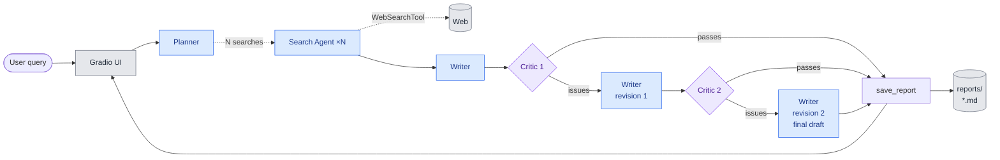

# deep-researcher

A small multi-agent **deep research** tool built on the [`openai-agents`](https://github.com/openai/openai-agents-python) SDK. Plans a set of web searches from a user query, runs them in parallel, synthesises the results into a long-form markdown report, **critiques** the draft against a fixed rubric, and revises up to twice if the critic flags issues — then saves the final report locally. Driven through a Gradio UI with live progress.

This project is the second inhabitant of the [`agentic-lab`](../) monorepo. It is a re-implementation of the deep-research example in `example-code/deep_research-example/`, with two intentional differences: a **critic + bounded revision loop** (new pattern not exercised by `sdr-agent`), and **local markdown persistence** instead of SendGrid delivery.

---

## What it does



<sub>🟦 gpt-4o-mini (OpenAI) — planner, search, writer · 🟪 gpt-4o (OpenAI) — critic, given a stricter rubric and a stronger model because LLMs are prone to fabricating citations · ⬜ external service · `··>` agent-as-tool / hosted tool · solid arrow = orchestrator-driven control flow</sub>

1. The user enters a query in the **Gradio UI**.
2. The **Planner** turns the query into a structured `WebSearchPlan` — a list of `N` (default 5) `WebSearchItem`s, each with a search term and a reason.
3. `N` **Search Agents** run in parallel; each calls OpenAI's hosted `WebSearchTool` (`tool_choice="required"`) and summarises the results in 2–3 paragraphs.
4. The **Writer** synthesises the summaries into a long-form markdown report (structured `ReportData`: short summary + full report + follow-up questions + `sources` list of URLs cited in the body). Every substantive claim must be followed by a standard markdown-link citation `[text](<url>)` where the URL came from a search summary.
5. The **Critic** scores the draft against a fixed three-criterion rubric — (1) **citation grounding** (every cited URL must come from a search summary; every URL in `sources` must appear in the body; every substantive claim must carry a markdown-link citation), (2) **query coverage**, (3) **structural coherence** — and returns a strict pass/fail (`CritiqueResult`).
6. If `Critic 1` fails the draft, the **Writer** is re-run with the previous draft and the issues attached, producing **draft 2**. The **Critic runs a second time** on draft 2. If `Critic 2` passes, ship. If `Critic 2` fails, its issues are yielded to the status feed *and* fed into one final revision pass — **draft 3** — which is shipped as-is (no `Critic 3`). Hard cap: writer runs at most 3 times, critic at most 2 times.
7. The final report is saved to `reports/{utc-timestamp}--{slug}.md` and yielded back to the Gradio UI.

### Patterns exercised

| Pattern              | Where                                                                                          |
| -------------------- | ---------------------------------------------------------------------------------------------- |
| Structured output    | `WebSearchPlan`, `ReportData` (incl. `sources: list[str]`), `CritiqueResult`                   |
| Parallel tool calls  | `asyncio.as_completed` over `N` Search Agent runs                                              |
| Hosted tool          | `WebSearchTool(search_context_size="low")` with `tool_choice="required"`                       |
| Critic + revision    | Orchestrator-driven loop: write → critique 1 → (if fail) revise → critique 2 → (if fail again) revise once more, then ship. Writer runs ≤3 times, critic ≤2. |
| Citation grounding   | Search agents emit URLs in their summaries → writer cites every substantive claim with a standard markdown link `[text](<url>)` and lists those URLs in `sources` → critic fails the draft if any cited URL didn't come from a search summary, forcing the writer to either ground or remove the claim. Standard markdown means no custom syntax — link text is free-form, only the URL is the contract. |
| Async generator      | `ResearchManager.run` yields status strings so CLI/UI consumers share one streaming contract   |
| Tracing              | `with trace("Deep research", trace_id=…)` wraps the whole run; URL yielded as the first status |

---

## Prerequisites

- The repo-root `agentic-lab` environment set up (`uv sync` from the repo root).
- One secret in the repo-root `.env` (gitignored):

  | Variable          | Purpose                                          |
  | ----------------- | ------------------------------------------------ |
  | `OPENAI_API_KEY`  | Every agent + the hosted `WebSearchTool` + tracing |

Non-secret configuration (model name, number of searches, reports directory) lives as Python defaults in `src/config.py` rather than in `.env`, to keep the shared lab `.env` clean.

---

## Quick start

From the repo root:

```bash
cd deep-researcher
uv run python -m src                                 # launches the Gradio UI in your browser
uv run python -m src "What is dark matter?"          # CLI mode: streams to stdout, no browser
```

Type a research question into the textbox (Gradio) or pass one as an argument (CLI), and watch the status feed:

```
View trace: https://platform.openai.com/traces/trace?trace_id=...
Planning searches…
Planned 5 searches. Searching…
Got 5 search summaries. Writing draft report…
Draft ready. Critiquing…
Critic flagged 3 issue(s). Revising once more…
Revision complete. Re-reviewing the revised draft…
Revised draft still has 2 issue(s). Doing one more revision pass (no further review after this — see remaining issues below):
  - URL https://… in sources does not appear in any search summary
  - Claim about X has no supporting markdown-link citation
Final revision complete. Saving.
Saved to reports/2026-05-12T143052Z--your-query-here.md
```

The happy path (`Critic 1` passes the first draft) is shorter — most runs land somewhere between that and the full three-draft path shown above.

The final report is rendered in the Gradio output pane (or printed to stdout in CLI mode) *and* saved on disk under `reports/`.

---

## Configuration

All non-secret settings are Python defaults in `src/config.py`. Override by editing that file directly — they are not exposed as env vars to keep the shared `.env` minimal.

| Setting        | Default       | Notes                                                                |
| -------------- | ------------- | -------------------------------------------------------------------- |
| `model`        | `gpt-4o-mini` | Planner, search agent, and writer                                    |
| `critic_model` | `gpt-4o`      | Critic only — a stronger model to catch fabricated citations         |
| `num_searches` | `5`           | The Planner is instructed to produce exactly this many search items  |
| `reports_dir`  | `<agent>/reports/` | Absolute path anchored to the agent directory; gitignored       |

---

## Project layout

The package follows the lab's "few deep modules" design — each module owns a capability and exposes one or more `build_*` factories.

```
deep-researcher/
├── README.md
├── pytest.ini             # per-agent pytest config (testpaths + pythonpath)
├── src/
│   ├── __init__.py        # public API: Settings, load_settings, ResearchManager
│   ├── __main__.py        # entry point: `python -m src` (Gradio) or `python -m src "<query>"` (CLI)
│   ├── config.py          # Settings dataclass + load_settings (OPENAI_API_KEY only)
│   ├── research.py        # Planner agent + Search agent + WebSearchPlan/WebSearchItem
│   ├── reporting.py       # Writer agent + Critic agent + ReportData/CritiqueResult
│   ├── storage.py         # slugify + save_report (pure Python, no agents)
│   └── orchestrator.py    # ResearchManager: async generator wiring it all together
└── tests/
    ├── conftest.py        # stub `settings` fixture; disables real .env loading
    ├── test_config.py     # required key, defaults, direct construction
    ├── test_storage.py    # slug edge cases, filename format, file contents
    └── test_wiring.py     # agent-graph shape (names, output_types, tool counts, tool_choice)
```

Public API:

```python
from src import Settings, load_settings, ResearchManager

manager = ResearchManager(load_settings())
async for chunk in manager.run("What is dark matter?"):
    print(chunk)
```

---

## Tracing

The `openai-agents` SDK ships traces to the OpenAI traces dashboard automatically when `OPENAI_API_KEY` is set. The trace URL for each run is yielded as the first status message, so you can jump straight to the agent graph and tool calls. View at <https://platform.openai.com/traces>.

---

## Tests

```bash
cd deep-researcher
uv run pytest                                       # all tests
uv run pytest tests/test_storage.py -v              # one file
```

The suite covers the bits that can break without an LLM in the loop: env validation in `config.py`, slug + filename + persistence behaviour in `storage.py`, and agent-graph wiring (which agents exist, their `output_type`, tool counts, `tool_choice`) in `research.py` and `reporting.py`. No network calls — `load_dotenv` is neutralised by `conftest.py`. LLM-driven behaviour (whether the planner picks *good* queries, whether the critic is a *useful* reviewer, the full revision loop) is intentionally not unit-tested, since mocking the model would only test the SDK rather than this code; that's verified by running the UI end-to-end.
