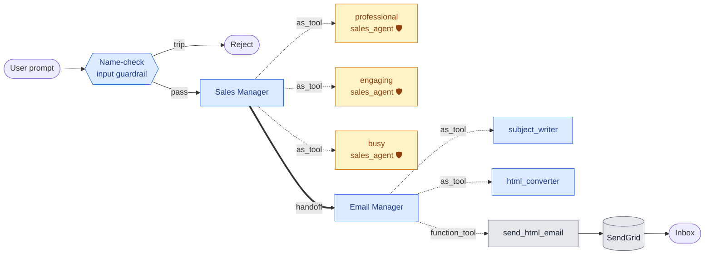

# sdr-agent

A small multi-agent **Sales Development Representative** (SDR) demo built on the [`openai-agents`](https://github.com/openai/openai-agents-python) SDK. Drafts three different cold-outreach emails in parallel (using Anthropic Claude Sonnet personas), picks the best one, formats it as HTML, and delivers it through SendGrid — all driven by an LLM "Sales Manager" that uses sub-agents as tools and hands off to a delivery agent.

This project is the first inhabitant of the [`agentic-lab`](../) monorepo. It is the fully-implemented version of Lab 2 + Lab 3 from `example-code/sdr-example/`, ported off the lab's multi-provider setup to a clean **Anthropic + OpenAI only** stack and a modular Python package.

---

## What it does



<sub>🟨 Sonnet (Anthropic) · 🟦 gpt-4o-mini (OpenAI) · ⬜ external service · `··>` agent-as-tool · `==>` handoff · 🛡️ output guardrail (placeholder-detection on `SalesEmailDraft.body`)</sub>

1. The **Sales Manager** receives a brief (e.g. *"Send a cold email to Dear CEO"*).
2. An **input guardrail** rejects the brief if it names a specific person.
3. The manager calls all three **persona sub-agents** (Sonnet) in parallel as tools, gets three drafts, and picks the best one. Each persona returns a structured `SalesEmailDraft` (Pydantic) and runs an **output guardrail** that rejects drafts containing un-filled template placeholders (`[INSERT NAME]`, `{{var}}`, `XXXX`).
4. It **hands off** the chosen draft to the **Email Manager**, which uses two utility sub-agents to write a subject line and HTML body, then calls the SendGrid `send_html_email` function tool.
5. The email lands in the configured recipient inbox.

### Patterns exercised

| Pattern              | Where                                                                                     |
| -------------------- | ----------------------------------------------------------------------------------------- |
| Agent-as-tool        | Personas, `subject_writer`, `html_converter` — parent agent calls them like functions     |
| Handoff              | Sales Manager → Email Manager — control passes across, not back                           |
| Function tool        | `send_html_email` — plain Python function lifted to a tool via `@function_tool`           |
| Input guardrail      | Name-check on the Sales Manager — refuses prompts that identify a specific recipient      |
| Output guardrail     | Placeholder-check on each persona — refuses drafts that contain template tokens           |
| Structured output    | `SalesEmailDraft(body: str)` returned by each persona via `output_type=`                  |
| Multi-provider       | Sonnet (Anthropic, via LiteLLM) + gpt-4o-mini (OpenAI) on the same agent graph            |

---

## Prerequisites

- The repo-root `agentic-lab` environment set up (`uv sync` from the repo root).
- Three secrets in the repo-root `.env` (which is gitignored):

  | Variable            | Purpose                                                       |
  | ------------------- | ------------------------------------------------------------- |
  | `OPENAI_API_KEY`    | Utility models (subject/html/guardrail) and SDK tracing       |
  | `ANTHROPIC_API_KEY` | Sonnet for the three sales-persona agents (via LiteLLM)       |
  | `SENDGRID_API_KEY`  | SendGrid mail send                                            |

- A **verified single sender** in your SendGrid account matching `SDR_FROM_EMAIL` (defaults to `alejandrofuentepinero@gmail.com`). Without verification, SendGrid rejects the send.

---

## Quick start

From the repo root:

```bash
cd sdr-agent
uv run python -m src                                # default brief
uv run python -m src "Send a cold email to Dear VP of Engineering"
```

Exit codes: `0` on success, `2` if the input guardrail trips, `3` if an output guardrail trips.

If nothing arrives, check your spam folder first — SendGrid sends frequently land there until the recipient marks them as Not Spam.

---

## Configuration

All settings are env-driven (`src/config.py`). Required keys are listed above; the rest are optional overrides:

| Variable             | Default                          | Notes                                       |
| -------------------- | -------------------------------- | ------------------------------------------- |
| `SDR_FROM_EMAIL`     | `alejandrofuentepinero@gmail.com`| Must be verified in SendGrid                |
| `SDR_TO_EMAIL`       | `alejandrofuentepinero@gmail.com`| Recipient                                   |
| `SDR_SALES_MODEL`    | `claude-sonnet-4-6`              | Anthropic model for the three personas      |
| `SDR_UTILITY_MODEL`  | `gpt-4o-mini`                    | OpenAI model for utility sub-agents         |

---

## Project layout

The package follows a "few deep modules" design — each module owns a capability and exposes a single `build_*` factory.

```
sdr-agent/
├── README.md
├── src/
│   ├── __init__.py        # public API
│   ├── __main__.py        # CLI: python -m src
│   ├── config.py          # Settings + env loading
│   ├── drafting.py        # 3 persona agents → tools; structured output + placeholder guardrail
│   ├── delivery.py        # subject/html sub-agents + SendGrid tool + Email Manager
│   └── orchestrator.py    # name-check input guardrail + Sales Manager
└── tests/
    ├── conftest.py        # stub `settings` fixture; disables real .env loading
    ├── test_config.py     # required-key errors, defaults, env overrides
    ├── test_drafting.py   # placeholder guardrail (positive, negative, false-positive traps)
    └── test_wiring.py     # agent-graph shape (tools, handoffs, guardrails)
```

Public API:

```python
from src import load_settings, build_sales_manager
from agents import Runner, trace

manager = build_sales_manager(load_settings())
with trace("Automated SDR"):
    await Runner.run(manager, "Send a cold email to Dear CEO")
```

---

## Tracing

The `openai-agents` SDK ships traces to the OpenAI traces dashboard automatically when `OPENAI_API_KEY` is set. After a run, view the agent graph and tool calls at <https://platform.openai.com/traces>.

---

## Tests

```bash
uv run pytest                         # all tests, from the repo root
uv run pytest sdr-agent/tests/test_drafting.py -v   # one file
```

The suite covers the bits that can break without an LLM in the loop: env-var validation in `config.py`, the placeholder output guardrail in `drafting.py`, and the agent-graph wiring (tools / handoffs / guardrail counts) in `orchestrator.py` and `delivery.py`. No network calls — `.env` loading is stubbed out by `conftest.py`. LLM-driven behavior (the name-check input guardrail, end-to-end runs) is intentionally not unit-tested, since mocking the model would only test the SDK, not this code.